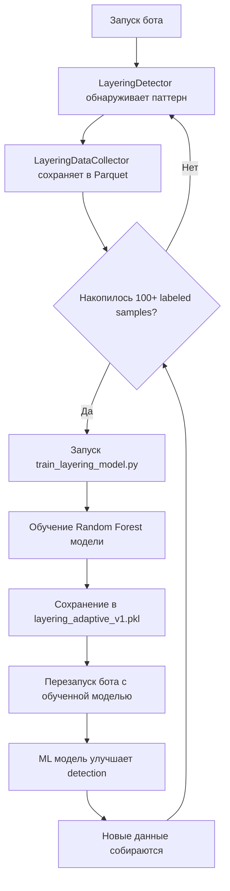

# 🧠 Layering ML Training System - Полное Руководство

## 📋 Содержание

1. [Что это такое](#что-это-такое)
2. [Архитектура системы](#архитектура-системы)
3. [Где участвует и как работает](#где-участвует-и-как-работает)
4. [Процесс сбора данных](#процесс-сбора-данных)
5. [Процесс обучения модели](#процесс-обучения-модели)
6. [Что делать с данными](#что-делать-с-данными)
7. [Практическое использование](#практическое-использование)

---

## 🎯 Что это такое?

**Layering ML** - это система машинного обучения для **автоматического обнаружения рыночных манипуляций** (layering/spoofing).

### Что такое Layering (Спуфинг)?

**Layering/Spoofing** - это манипуляция рынком, когда трейдер:
1. Размещает **большие ложные ордера** на одной стороне (spoofing side)
2. Создает иллюзию спроса/предложения
3. **Торгует** на противоположной стороне (execution side)
4. **Быстро отменяет** ложные ордера после получения прибыли

**Пример:**
```
1. Размещает 100 BTC bid ордеров на $40,000-40,005 (ложные)
2. Создается впечатление сильного спроса
3. Цена идет вверх из-за иллюзии
4. Продает 2 BTC по $40,010-40,015 (реальная торговля)
5. Отменяет все 100 BTC bid ордера
6. Профит!
```

---

## 🏗️ Архитектура системы

### Три основных компонента:

#### 1️⃣ **LayeringDetector** (Детектор)
**Файл:** `backend/ml_engine/detection/layering_detector.py`

**Что делает:**
- Анализирует orderbook в реальном времени
- Обнаруживает подозрительные паттерны
- Вычисляет confidence score (0.0-1.0)
- Генерирует алерты

**Алгоритм обнаружения:**
```python
# 1. Находит слои ордеров (layers)
- Минимум 3 ордера на близких ценах
- Размещены за короткое время (< 30 сек)
- Похожие размеры (CV < 30%)

# 2. Анализирует торговлю на противоположной стороне
- Есть ли execution после размещения?
- Correlation timing (< 60 сек)

# 3. Проверяет отмены
- Cancellation rate > 50%?
- Быстрая отмена после execution?

# 4. Вычисляет confidence
confidence = (
    0.25 * volume_score +        # Большой объем = подозрительно
    0.20 * timing_score +         # Быстрое размещение = подозрительно
    0.25 * cancellation_score +   # Много отмен = подозрительно
    0.15 * execution_correlation + # Correlation execution = подозрительно
    0.15 * price_impact_score     # Низкий реальный impact = подозрительно
)
```

#### 2️⃣ **LayeringDataCollector** (Сборщик данных)
**Файл:** `backend/ml_engine/detection/layering_data_collector.py`

**Что делает:**
- Собирает **все обнаруженные паттерны** в Parquet файлы
- Сохраняет **features** (характеристики паттерна)
- Сохраняет **labels** (true positive / false positive)
- Готовит данные для обучения ML модели

**Структура данных (LayeringDataPoint):**
```python
# FEATURES (X) - характеристики паттерна:
- total_volume_btc          # Объем слоя (BTC)
- total_volume_usdt         # Объем слоя (USDT)
- placement_duration        # Длительность размещения (сек)
- cancellation_rate         # Процент отмен (0.0-1.0)
- spoofing_execution_ratio  # Spoofing volume / Execution volume
- layer_count               # Количество слоев
- total_orders              # Количество ордеров
- avg_order_size            # Средний размер ордера
- price_spread_bps          # Spread внутри слоя (bps)

# Market Context:
- market_regime             # "bullish", "bearish", "sideways"
- volatility_24h            # Волатильность (%)
- volume_24h                # Объем торгов 24h
- liquidity_score           # Ликвидность рынка (0-1)
- hour_utc                  # Час дня (0-23)
- day_of_week               # День недели (0-6)

# LABELS (y) - правда или ложь:
- is_true_layering          # True/False/None (None = unlabeled)
- label_source              # "automatic", "manual", "price_action"
- label_confidence          # Уверенность в метке (0-1)
```

**Где хранятся данные:**
```
data/ml_training/layering/
├── layering_data_20251115_100000.parquet  # Batch 1 (100 samples)
├── layering_data_20251115_110000.parquet  # Batch 2 (100 samples)
├── layering_data_20251115_120000.parquet  # Batch 3 (100 samples)
└── statistics.json                         # Статистика
```

#### 3️⃣ **AdaptiveLayeringModel** (ML Модель)
**Файл:** `backend/ml_engine/detection/adaptive_layering_model.py`

**Что делает:**
- Обучается на собранных данных
- Классифицирует паттерны: True Positive vs False Positive
- Предсказывает adaptive thresholds (адаптивные пороги)
- Улучшает accuracy detection

**Модель:**
- **Алгоритм:** Random Forest Classifier (100 деревьев)
- **Features:** 24 признака (см. выше)
- **Target:** is_true_layering (True/False)
- **Метрики:** Accuracy, Precision, Recall, F1, ROC AUC

---

## 🔄 Где участвует и как работает

### Интеграция в main.py

**Инициализация (backend/main.py:1005-1023):**
```python
# При старте бота создается LayeringDataCollector
from backend.ml_engine.detection.layering_data_collector import LayeringDataCollector

self.layering_data_collector = LayeringDataCollector(
    data_dir="data/ml_training/layering",
    enabled=True,                    # Включен в ONLY_TRAINING и FULL mode
    auto_save_interval=100           # Сохранять каждые 100 samples
)

logger.info("✅ LayeringDataCollector активен")
```

### Процесс сбора данных в реальном времени

**Шаг 1: Обнаружение паттерна (layering_detector.py:1300-1400)**
```python
async def analyze_orderbook(...):
    # 1. Detector находит suspicious layer
    if confidence >= self.config.min_confidence:  # >= 0.65

        # 2. Подготовка данных для ML
        pattern_data = {
            'timestamp': int(time.time() * 1000),
            'symbol': symbol,
            'total_spoofing_volume': layer.total_volume,
            'placement_duration': layer.placement_duration,
            'cancellation_rate': cancellation_rate,
            'layer_count': 3,
            'confidence': confidence,
            ...
        }

        market_context = {
            'market_regime': 'bullish',
            'volatility_24h': 2.5,
            'volume_24h': 15000000,
            'liquidity_score': 0.8,
            ...
        }

        confidence_components = {
            'volume': 0.20,
            'timing': 0.15,
            'cancellation': 0.25,
            'execution_correlation': 0.15,
            'price_impact': 0.10
        }

        # 3. СБОР ДАННЫХ В ML COLLECTOR
        data_id = self.data_collector.collect(
            pattern_data,
            market_context,
            confidence_components,
            label=None,              # Unlabeled initially
            label_source="automatic",
            label_confidence=0.0
        )

        logger.info(f"📊 Layering ML data collected: {data_id}")
```

**Шаг 2: Автосохранение (layering_data_collector.py:236-239)**
```python
# В буфере накопилось 100 samples
if len(self.data_buffer) >= self.auto_save_interval:  # >= 100
    self.save_to_disk()

    # Сохраняет в:
    # data/ml_training/layering/layering_data_20251115_120000.parquet
```

**Шаг 3: Финализация при shutdown (main.py:4204)**
```python
async def shutdown():
    # Принудительное сохранение при выключении бота
    if self.layering_data_collector:
        self.layering_data_collector.save_to_disk()
```

### Когда происходит сбор?

**Сбор данных активен в режимах:**

1. **ONLY_TRAINING** - только сбор данных, без торговли
2. **FULL** - полная торговля + сбор данных в фоне

**Частота сбора:**
- **Триггер:** Каждый раз, когда LayeringDetector обнаруживает паттерн с confidence >= 0.65
- **Объем:** Зависит от рыночной активности (обычно 10-100 паттернов в день)
- **Автосохранение:** Каждые 100 паттернов

---

## 📊 Процесс сбора данных

### Фаза 1: Автоматический сбор (1-7 дней)

**Запуск:**
```bash
# В config/.env
TRADING_MODE=ONLY_TRAINING  # Или FULL

# Запускаем бота
python backend/main.py
```

**Что происходит:**
```
[INFO] ✅ LayeringDataCollector активен
[INFO] 📊 Layering detected: BTCUSDT | confidence=0.78
[INFO] 📊 Layering ML data collected: BTCUSDT_1731668400000_0
...
[INFO] 💾 Saved 100 samples to layering_data_20251115_120000.parquet
[INFO] 📊 Layering detected: ETHUSDT | confidence=0.82
...
```

**Мониторинг прогресса:**
```bash
# Проверка количества собранных данных
ls -lh data/ml_training/layering/*.parquet

# Статистика через API
curl -X GET "http://localhost:8000/api/ml/data-collector/statistics"
```

**Ожидаемый результат:**
```json
{
  "enabled": true,
  "total_collected": 523,
  "total_labeled": 0,          # Пока unlabeled
  "buffer_size": 23,
  "files_on_disk": 5,
  "labeling_rate": 0.0
}
```

### Фаза 2: Labeling (Опционально)

**Зачем нужен labeling?**
- Изначально все паттерны **unlabeled** (label=None)
- Для **supervised learning** нужны labels: True Positive / False Positive
- Можно использовать **automatic labeling** (по price action) или **manual labeling**

**Automatic Labeling (через price action):**
```python
# В layering_detector.py можно добавить автоматическую разметку:
# Если цена движется как ожидалось → True Positive
# Если цена НЕ движется → False Positive

if price_moved_as_expected and manipulation_successful:
    label = True   # True layering
else:
    label = False  # False positive
```

**Manual Labeling (через API):**
```bash
# Обновить label для конкретного data_id
curl -X POST "http://localhost:8000/api/ml/data-collector/update-label" \
  -H "Content-Type: application/json" \
  -d '{
    "data_id": "BTCUSDT_1731668400000_0",
    "label": true,
    "label_source": "manual",
    "label_confidence": 1.0,
    "notes": "Confirmed layering - price manipulated successfully"
  }'
```

---

## 🎓 Процесс обучения модели

### Требования для обучения

**Минимум:**
- ✅ 100 labeled samples
- ✅ Минимум 5 True Positives
- ✅ Минимум 5 False Positives

**Рекомендуется:**
- 🎯 500-1000 labeled samples
- 🎯 Balanced dataset (50/50 true/false)

**Оптимально:**
- 🚀 5000+ labeled samples
- 🚀 Разнообразные market conditions

### Скрипт обучения

**Файл:** `backend/scripts/train_layering_model.py`

**Запуск:**
```bash
cd /home/user/new_bot_ver3
python backend/scripts/train_layering_model.py
```

**Что происходит:**
```
================================================================================
🎓 ADAPTIVE LAYERING MODEL TRAINING PIPELINE
================================================================================

📚 Loading training data...
✅ Loaded 523 labeled samples
   True positives: 312
   False positives: 211
   Balance: 59.7% positive

🎓 Training model...
Training classifier...
✅ Training complete!
   Accuracy:  0.876
   Precision: 0.842
   Recall:    0.891
   F1 Score:  0.866
   ROC AUC:   0.923

================================================================================
📊 TRAINING RESULTS
================================================================================
Accuracy:  0.876
Precision: 0.842
Recall:    0.891
F1 Score:  0.866
ROC AUC:   0.923

Confusion Matrix:
  TN:   78  FP:   15
  FN:   13  TP:   89

✅ Model saved: data/models/layering_adaptive_v1.pkl

🔝 Top 10 Features:
   1. cancellation_rate              : 0.1542
   2. spoofing_execution_ratio       : 0.1287
   3. total_volume_usdt              : 0.0943
   4. placement_duration             : 0.0821
   5. execution_correlation_score    : 0.0765
   6. price_impact_score             : 0.0712
   7. volatility_24h                 : 0.0654
   8. layer_count                    : 0.0598
   9. liquidity_score                : 0.0521
  10. hour_utc                       : 0.0487

================================================================================
✅ TRAINING COMPLETE
================================================================================
```

### Использование обученной модели

**Автозагрузка при старте:**
```python
# backend/ml_engine/detection/layering_detector.py
self.adaptive_model = AdaptiveLayeringModel(
    model_path="data/models/layering_adaptive_v1.pkl",  # Auto-load
    enabled=True
)
```

**Использование для улучшения detection:**
```python
# Predict if pattern is true layering
is_true, ml_confidence = self.adaptive_model.predict(features)

# Adjust confidence based on ML prediction
if is_true:
    final_confidence = (detector_confidence + ml_confidence) / 2
else:
    final_confidence = detector_confidence * 0.5  # Снижаем если ML thinks false

# Use adaptive thresholds
adaptive_thresholds = self.adaptive_model.predict_adaptive_thresholds(
    market_context
)
# adaptive_thresholds.confidence_threshold = 0.72 (например, выше при высокой volatility)
```

---

## 🛠️ Что делать с данными

### Сценарий 1: Первый запуск (сбор данных)

**Цель:** Собрать данные для будущего обучения

**Действия:**
```bash
# 1. Убедитесь что режим правильный
# config/.env
TRADING_MODE=ONLY_TRAINING  # Безопасно, без торговли

# 2. Запустите бота
python backend/main.py

# 3. Подождите 1-7 дней (зависит от активности рынка)

# 4. Проверяйте прогресс
ls -lh data/ml_training/layering/*.parquet

# Ожидаемо: 10-100 паттернов в день
# За 7 дней: 70-700 samples
```

**Результат:**
- ✅ Собраны unlabeled данные
- ✅ Готовы для labeling
- ✅ Бот НЕ торгует (ONLY_TRAINING)

### Сценарий 2: Labeling и обучение

**Цель:** Обучить ML модель для улучшения accuracy

**Действия:**

**Вариант A - Automatic Labeling (проще):**
```python
# Реализовать в layering_detector.py automatic labeling logic
# на основе price action validation

# Пример:
if confidence >= 0.75:
    # Подождать 60 секунд
    await asyncio.sleep(60)

    # Проверить price movement
    price_moved = check_price_movement()

    if price_moved:
        # Update label to True
        self.data_collector.update_label(
            data_id=data_id,
            label=True,
            label_source="price_action",
            label_confidence=0.9
        )
    else:
        # Update label to False
        self.data_collector.update_label(
            data_id=data_id,
            label=False,
            label_source="price_action",
            label_confidence=0.8
        )
```

**Вариант B - Manual Labeling (точнее):**
```bash
# 1. Экспортируйте данные
python -c "
from backend.ml_engine.detection.layering_data_collector import LayeringDataCollector
collector = LayeringDataCollector(data_dir='data/ml_training/layering')
df = collector.load_all_data()
df.to_csv('layering_samples_for_review.csv')
print(f'Exported {len(df)} samples')
"

# 2. Вручную проверьте каждый паттерн и добавьте колонку 'label' (True/False)

# 3. Импортируйте обратно
python -c "
import pandas as pd
from backend.ml_engine.detection.layering_data_collector import LayeringDataCollector
collector = LayeringDataCollector(data_dir='data/ml_training/layering')
df = pd.read_csv('layering_samples_labeled.csv')
for _, row in df.iterrows():
    collector.update_label(
        data_id=row['data_id'],
        label=bool(row['label']),
        label_source='manual',
        label_confidence=1.0
    )
print('Labels imported')
"
```

**Обучение:**
```bash
# После labeling >= 100 samples
python backend/scripts/train_layering_model.py

# Результат:
# ✅ data/models/layering_adaptive_v1.pkl создан
# ✅ Метрики показывают accuracy >= 85%
```

### Сценарий 3: Production использование

**Цель:** Использовать обученную модель для улучшения detection

**Действия:**
```bash
# 1. Убедитесь что модель обучена
ls -lh data/models/layering_adaptive_v1.pkl

# 2. Переключитесь в FULL режим
# config/.env
TRADING_MODE=FULL

# 3. Запустите бота
python backend/main.py

# Логи:
# [INFO] ✅ AdaptiveLayeringModel initialized: trained=True
# [INFO] 📊 Layering detected: BTCUSDT | detector_conf=0.78, ml_conf=0.85
# [INFO] 🎯 Final confidence: 0.815 (ML-adjusted)
```

**Результат:**
- ✅ ML модель улучшает accuracy
- ✅ Меньше false positives
- ✅ Adaptive thresholds по market conditions
- ✅ Данные продолжают собираться для дальнейшего обучения

### Сценарий 4: Continuous Learning (непрерывное обучение)

**Цель:** Постоянно улучшать модель новыми данными

**Действия:**
```bash
# 1. Запустите бота в FULL режиме (торговля + сбор)
TRADING_MODE=FULL
python backend/main.py

# 2. Периодически (раз в неделю/месяц) переобучайте модель
# Cron job:
0 0 * * 0 cd /home/user/new_bot_ver3 && python backend/scripts/train_layering_model.py

# 3. Мониторьте метрики модели
curl -X GET "http://localhost:8000/api/ml/adaptive-model/metrics"
```

**Результат:**
- ✅ Модель адаптируется к изменениям рынка
- ✅ Accuracy улучшается со временем
- ✅ Обнаружение новых типов манипуляций

---

## 📈 Практическое использование

### Анализ собранных данных

**Просмотр данных:**
```python
from backend.ml_engine.detection.layering_data_collector import LayeringDataCollector

collector = LayeringDataCollector(data_dir='data/ml_training/layering')

# Статистика
stats = collector.get_statistics()
print(f"Total collected: {stats['total_collected']}")
print(f"Labeled: {stats['total_labeled']}")
print(f"True positives: {stats['true_positives']}")
print(f"False positives: {stats['false_positives']}")

# Загрузить все данные
df = collector.load_all_data()
print(df.head())
print(df.describe())

# Только labeled
labeled_df = collector.get_labeled_data()
print(f"Labeled samples: {len(labeled_df)}")

# Train/test split
split = collector.get_training_split(test_size=0.2)
train_df = split['train']
test_df = split['test']
print(f"Train: {len(train_df)}, Test: {len(test_df)}")
```

### Экспорт данных

**Для внешнего анализа:**
```python
from backend.ml_engine.detection.layering_data_collector import LayeringDataCollector

collector = LayeringDataCollector(data_dir='data/ml_training/layering')

# Export labeled data
collector.export_for_training('layering_training_data.parquet')

# Или в CSV для Excel/Google Sheets
df = collector.get_labeled_data()
df.to_csv('layering_training_data.csv', index=False)
```

### API Endpoints для управления

**Доступные endpoints:**
```bash
# Статистика коллектора
GET /api/ml/data-collector/statistics

# Получить labeled данные
GET /api/ml/data-collector/labeled-data

# Обновить label
POST /api/ml/data-collector/update-label
{
  "data_id": "BTCUSDT_1731668400000_0",
  "label": true,
  "label_source": "manual",
  "label_confidence": 1.0
}

# Статус ML модели
GET /api/ml/adaptive-model/status

# Метрики модели
GET /api/ml/adaptive-model/metrics

# Запустить обучение (async)
POST /api/ml/adaptive-model/train
```

---

## 🎯 Резюме

### Полный цикл работы с Layering ML:



### Ключевые файлы:

| Файл | Назначение |
|------|-----------|
| `backend/ml_engine/detection/layering_detector.py` | Обнаружение паттернов |
| `backend/ml_engine/detection/layering_data_collector.py` | Сбор данных |
| `backend/ml_engine/detection/adaptive_layering_model.py` | ML модель |
| `backend/scripts/train_layering_model.py` | Скрипт обучения |
| `data/ml_training/layering/*.parquet` | Собранные данные |
| `data/models/layering_adaptive_v1.pkl` | Обученная модель |

### Что делать СЕЙЧАС:

**Если хотите начать сбор данных:**
```bash
# 1. Проверьте что зависимости установлены
pip install -r requirements.txt

# 2. Настройте режим
# config/.env
TRADING_MODE=ONLY_TRAINING  # Безопасно

# 3. Запустите бота
python backend/main.py

# 4. Через неделю → обучайте модель
```

**Если хотите обучить модель:**
```bash
# 1. Проверьте наличие данных
ls -lh data/ml_training/layering/*.parquet

# 2. Если >= 100 labeled samples → обучайте
python backend/scripts/train_layering_model.py

# 3. Если unlabeled → сначала label их (automatic или manual)
```

**Если хотите использовать готовую модель:**
```bash
# 1. Убедитесь что модель существует
ls -lh data/models/layering_adaptive_v1.pkl

# 2. Переключитесь в FULL режим
# config/.env
TRADING_MODE=FULL

# 3. Запустите бота
python backend/main.py
# Модель загрузится автоматически!
```

---

## 📞 Troubleshooting

### Проблема: "No layering data collected"

**Причины:**
1. Нет manip активности на рынке (нормально)
2. Confidence слишком высокий (detector не находит паттернов)

**Решение:**
```python
# Понизьте min_confidence в layering_detector.py
min_confidence: float = 0.50  # Было 0.65
```

### Проблема: "Insufficient labeled data: 23 samples"

**Причина:** Недостаточно labeled samples для обучения

**Решение:**
1. Подождите больше времени (1-2 недели)
2. Реализуйте automatic labeling
3. Или вручную разметьте данные

### Проблема: "Model accuracy too low: 0.52"

**Причина:** Плохое качество данных или неправильный labeling

**Решение:**
1. Проверьте labeling logic
2. Увеличьте количество samples
3. Проверьте class balance (50/50 true/false)

---

**Версия:** 1.0
**Дата:** 2025-11-15
**Автор:** Claude (Anthropic)
